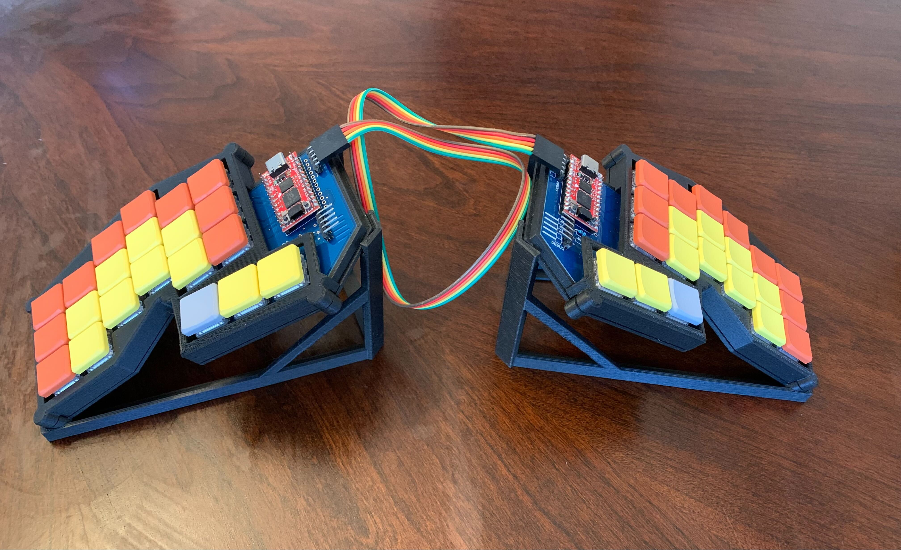
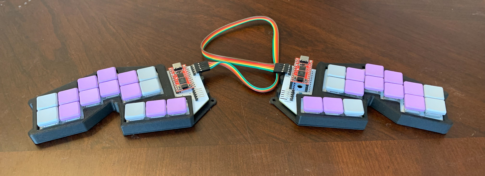
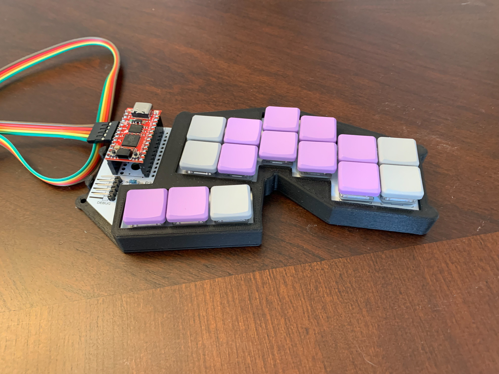
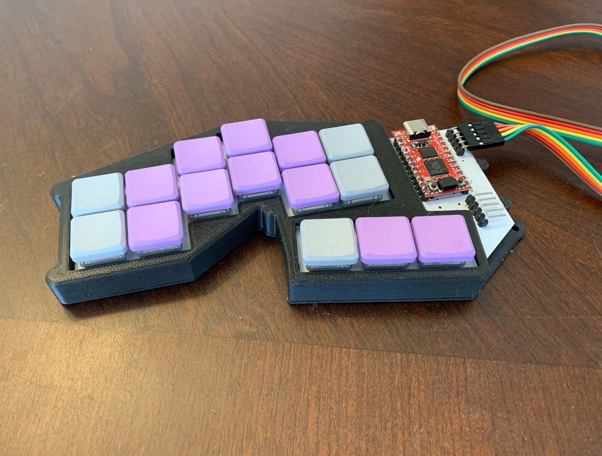

# David Brown (d3zd3z) keyboard designs

This repo captures the design files associated with my custom
keyboards.

These keyboards are primarily focused on Steno input, mainly using
[Plover](https://www.openstenoproject.org/plover/). In the spirit of
open steno, I have made these designs open. Anyone is free to make
designs based on these keyboards, for non-commercial purposes.  I am
releasing the designs under the [CC BY-NC
3.0](https://creativecommons.org/licenses/by-nc/3.0/) license.
Specifically, this means if you wish to sell a product based on the
design, you should talk to me.

## The "Jolt" keyboard

At this point, I've decided to give the keyboard a real name, hence "jolt".  The jolt 1 is still in
Eagle, and I may migrate the files here.

But, I have added the "jolt2".  The jolt2 is an experiment beyond just a traditional corne-like
keyboard, and something fully in 3-space, like the dactyl.  There are individual base plates for
left and right, and then small strips of 3 keys for each column.  The base PCB has 4 pairs of pin
headers to support these individual 3-key columns.  This will allow me to experiment with elevation
as well as just the X and Y position of each key.  I still want each column to be at the same
elevation, because I rely heavily on pressing keys together (both for my qwerty layout, and for
steno).

At this point, there are 4 PCBs here:

- [jolt2-left](jolt2/jolt2-left/): The layout of the left
  side using a directly assembled rp2040
- [jolt2-tiny2040-left](jolt2/jolt2-tiny2040-left/): The same left side pcb, but built around the [Pimoroni
  Tiny 2040](https://shop.pimoroni.com/products/tiny-2040?variant=39560012234835).  Note that only
  the left side needs the 8MB version (to hold the steno dictionary), but I just ordered all the
  same, and use the 8MB version on each side.
- [jolt2-tiny2040-right](jolt2/jolt2-tiny2040-right/): The Tiny 2040-based, made for the right side.
- [jolt2-verts](jolt2/jolt2-verts/): These are the small 3-key support boards.  It will take 28 of these,
  plus a left and a right to build a full keyboard.

In addition, there is also a [jolt2-pim-left](jolt2/jolt2-pim-left/), based around the [Pimoroni
PGA2350](https://shop.pimoroni.com/products/pga2350?variant=42092629229651).  There are numerous
errors in this that need to be fixed, as I messed up the reference numbers for the headers to the
key-boards.

## The "bletest2"

This isn't really a keyboard, but my experiments putting an nRF5340 module on a board.  This is work
in progress, and has numerous things I've discovered wrong with it.  I will work to improve it over
time:

- The power supply was suppose to auto switch between USB power and battery power.  However, I
  accidentally chose a boost converter instead of a boost/buck converter, and if USB is connected,
  all it does is fry everything on the board.  You can either leave out D1, or install a chain of
  diodes in its place (I used 5) to drop the voltage enough to make VBUS less than the 3.3.
  Auto-switching will probably end up preferring the battery, though, so I just recommend removing
  D1 entirely, and powering the board off of the batteries.
- The RGB LEDs don't work.  I'm not quite sure what is wrong, as I see no signal on the DIN pin.  I
  maybe have issues, given the difficult of properly soldering down the BLE module.
- The LEDs probably need a 5V supply, which isn't readily available.  Realistically, if I build a
  battery power device, I'll likely just use an analog RGB component, and use 3 gpios with PWM.

The intent was to be able to remove the various jumpers, and use the Power Profiler Kit II to
observer power consumption.  Despite rev 2, I'm still not far enough along with this to be able to
do that meaningfully.

## The "shield-kb1"

This is an Arduino-style shield, designed to plug into the nRF5340 DK.  It provides non-working
LEDs, a 2x2 keyboard matrix, and inter-board headers for left and right that should allow it to talk
to the jolt or proto3 designs.

## The "proto3"

This is basically the same design as the proto2, but with a third row.
The qmk supports an easier qwerty mode, but still with a modified
homerow modifier support (I use the lower row as it has slightly fewer
rollover conflicts).

The BOM is the same as the proto2, but it will need 42 diodes.

## The "proto2"

For lack of a better name, this first design is called the "proto2".

There was an earlier prototype, that was handwired, and rather
fragile.  This is the first version I would consider to be a usable
keyboard.  In the above pictures, the left half has the MCU (Pro Micro
RP2040) soldered directly to a header, soldered to the PCB, and the
right one uses a socket.

To build this, in addition to the PCBs, you will need

- 2 [Pro Micro RP2040](https://www.sparkfun.com/products/18288)
  boards.  At the time of my build, these are running about $11, and
  seem readily available.
- 30 Kailh Choc switches.  I sourced mine from
  [Mkultra](https://mkultra.click/choc-switches).  I recommend the
  "pink" version, which has 20gf springs, and I find work well.
- 30 keycaps for these switches.  I used the [MBK Factory
  Colors](https://mkultra.click/mbk-factory-colors/) keycaps, which
  allows me to make the "primary" keys stand out a little, and just
  looks rather nice.
- 30 general purpose SOD123 diodes.  I got
  [BAV19W](https://www.digikey.com/en/products/detail/smc-diode-solutions/BAV19W/5993796),
  although almost any diode will work for this.
- 2 or 4 5-pin right angle headers.  Two are needed for the
  communication between the boards.  The others are interested if you
  want to use SWD, since the RP2040 Pro Micro inconveniently puts
  these connectors on the underside of the board.

The PCB is reversable.  The RP2040 board should be mounted in the
labeled holes, which is always the left set when viewed from the top.
The diodes are intended to be soldered to the bottom side of the
board.

I have also a case design that can be 3d printed.  The models are for
the right side. Use your slicing software to mirror about the X axis
to print the pieces for the other side.

The firmware I am using for this keyboard is in my fork of
[QMK](https://github.com/tangybbq/qmk_firmware/tree/proto2).
