# Assembly of keyboards

These instructions describe how to assembly the "Jolt2".  In the images are the "dir" variant which
has the rp2040 directly mounted on the board.  The assembly describe here is the same for the key
parts, no matter which variant is chosen.

## Key base

Before assembling all of the vertical risers, it is probably best to assemble the base, and make
sure it works.

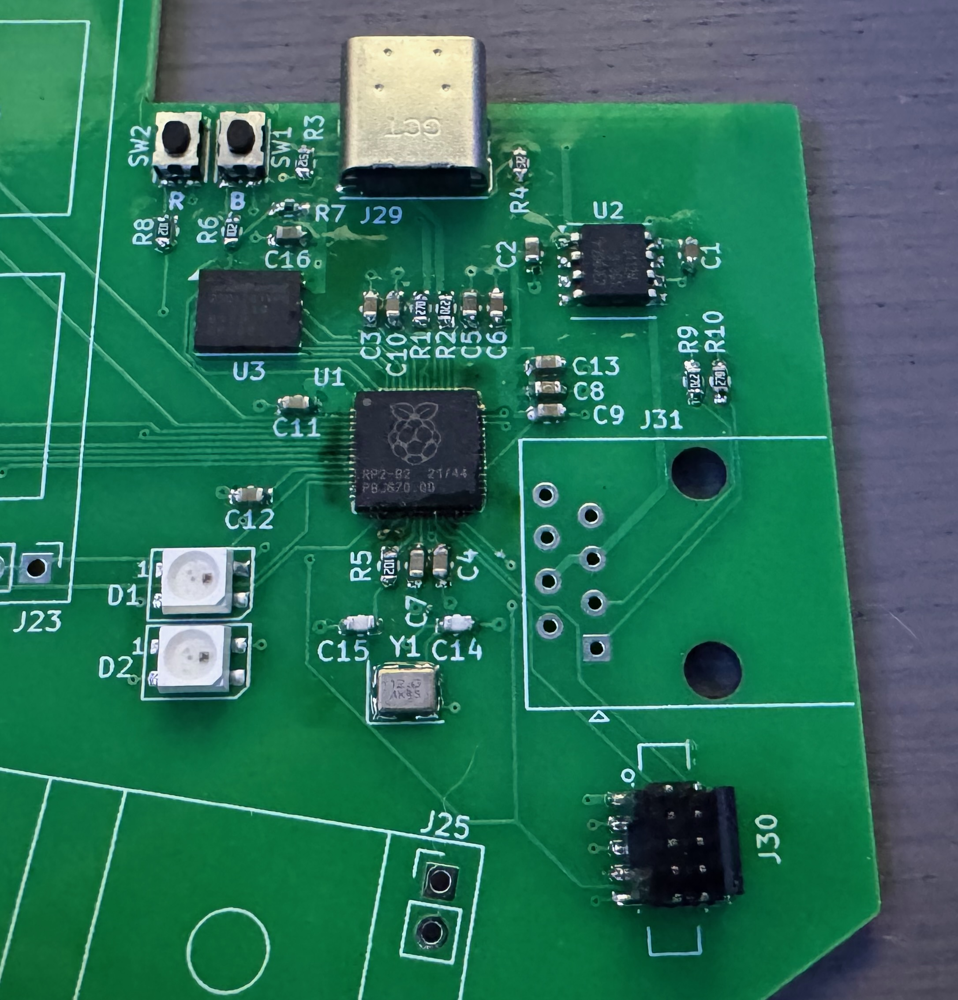

As you can see here, I've done most of the assembly, and testing revealed that not all of the pins
on the rp2040 have contact. I spent some time getting this to work (meanwhile gradually getting
better at SMD assembly).

Once I got the rp2040 mounted (with a good layer of residual no-clean flux), and figured out that
the SK6812-MINI and the SK6812-MINI-HS have very different footprints, I got the main part working.
I used a wire across the key mounts (J1-J28) by connecting the lowest numbered pin with one of the
others to simulate that key being pressed, and confirmed that the circuitry was working.

The base PCB ends up looking like this:

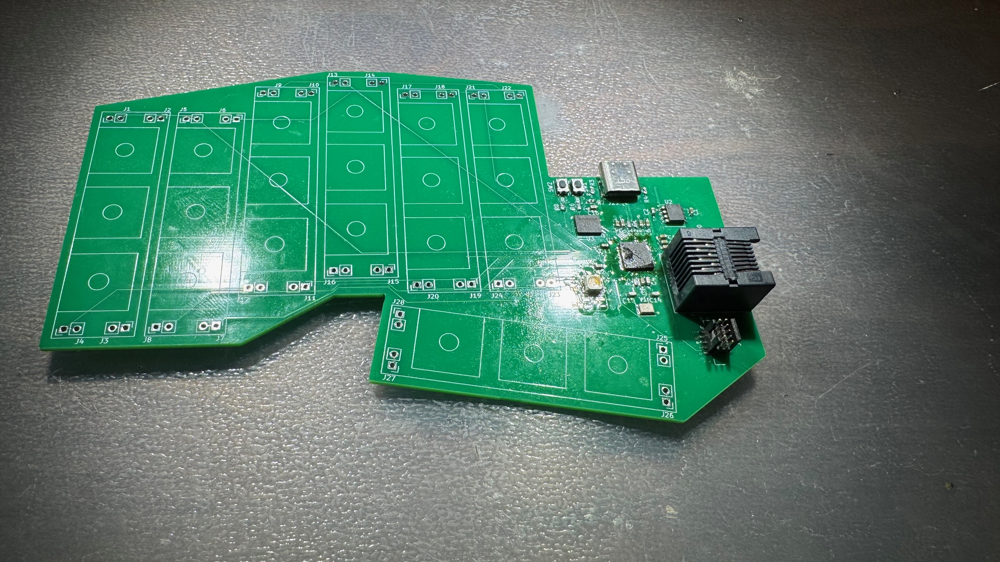

## Risers

For each keyboard half, 7 risers are needed (the "verts").  Each has 3 diodes, and 3 sockets for
Kailh Choc v1 switches. I have had much better results soldering the sockets while having a switch
mounted as I found that sometimes adding the switch later, the misalignment was sufficient enough to
permanently damage the socket.

The end result looks like this:

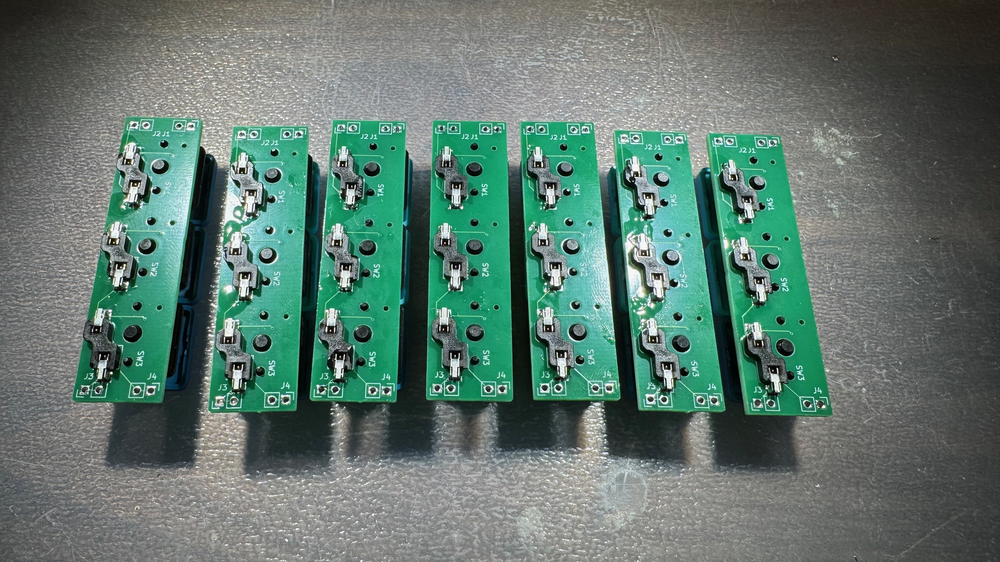

With the tops looking like:

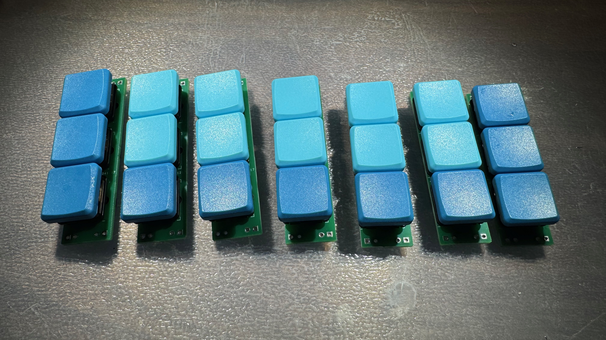

## Mounting the risers

The risers for the left side should be installed starting from the keys closest to the circuitry
(index finger keys) and working your way left. That is because the spacer jig used to add them only
comes out in one direction, due to the position of the switches.

For the right side, you can assembl starting from the pinky keys. It can be a little tricky to get
the jig out of the keys nearest the CPU (the pushbuttons notably get in the way.  What I did is just
solder the pins furthest from the circuitry, and was able to lift the PCB up enough to get the
spacer out. I then used the spacer along the edge to solder the last pieces.)

You can use pin headers of an appropriate length, or just get a pack of long ones.  Ideal lengths
for the 4 heights used here are 8mm, 10mm, 12mm, and 16mm.  In my case, I had 12 and 19mm header
pins, and used an appropriate one, cutting for the rest.

The two part (TODO: STL) header jig holds the header pins in position to solder.  Place the
appropriate pins, long end first, into the jig, and use the second part to push them flush. For most
headers, this moves the plastic part slightly.

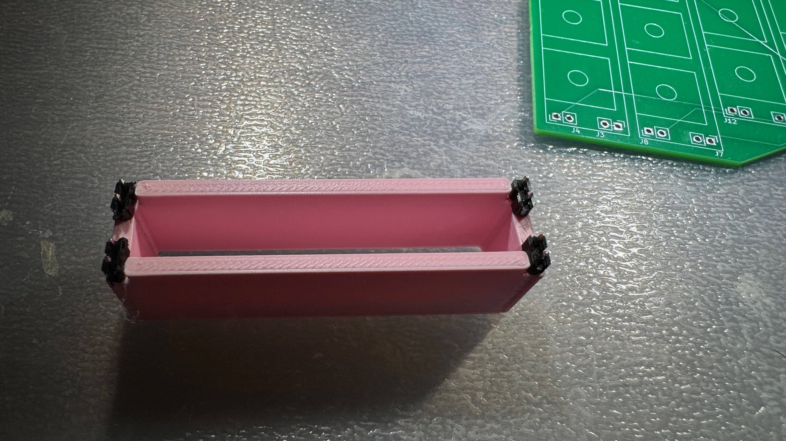

The jig and pins are then placed, and the pins solder. I generall solder one pin and check that the
plastic part is flush, if not, heat that one pin while pushing on the jig.  After everything is
solder, the jig is then removed, and the pins should be solidly positioned.

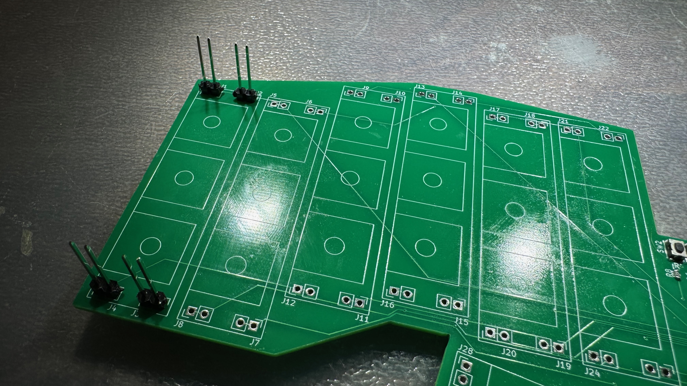

**Note**: I started at the wrong end here, but caught myself before moving to the next step.

Once the pins are in place, add the appropriate spacer, as shown.  The two pinky columns and the two
index columns should use the "thick" space (10mm). The middle finger the thin spacer (4mm), and the
ring finger the medium spacer (6mm).  There is likely variation in hand shape here, although
experiementing is a bit tedious.

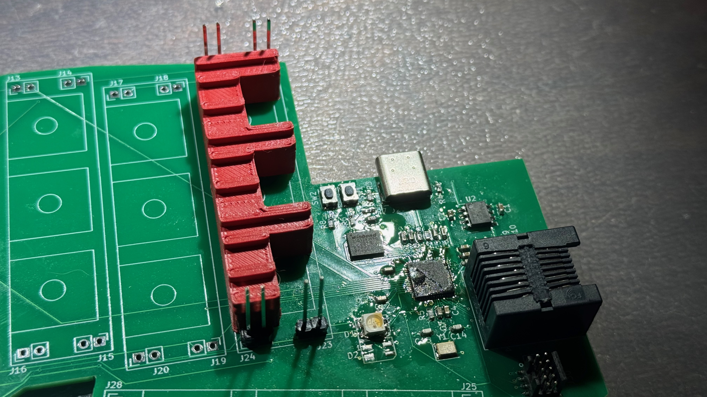

If you need to cut the pins, it is easiest at this point to add an unassembled riser board, holding
it firmly while using cutters to shorten the pins.

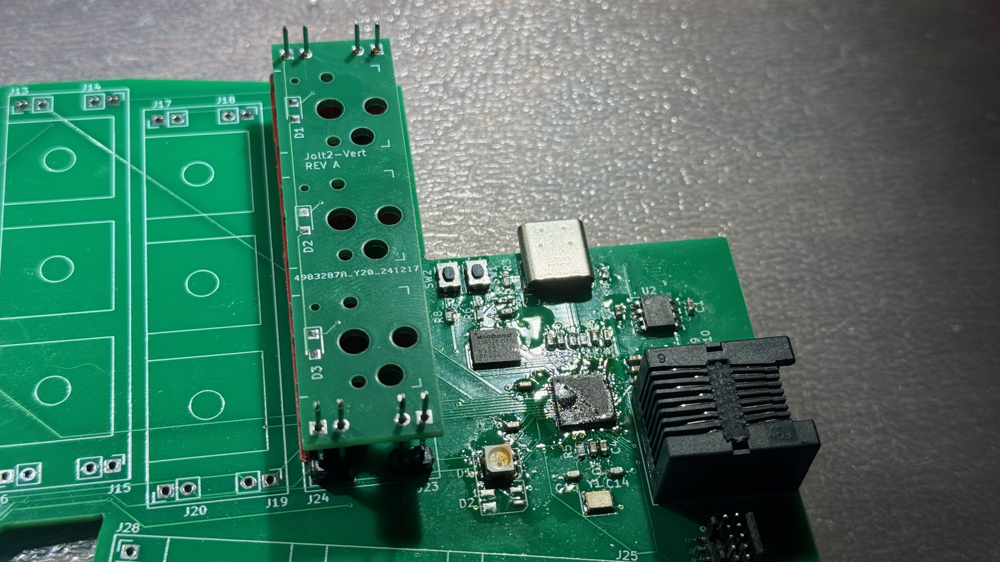
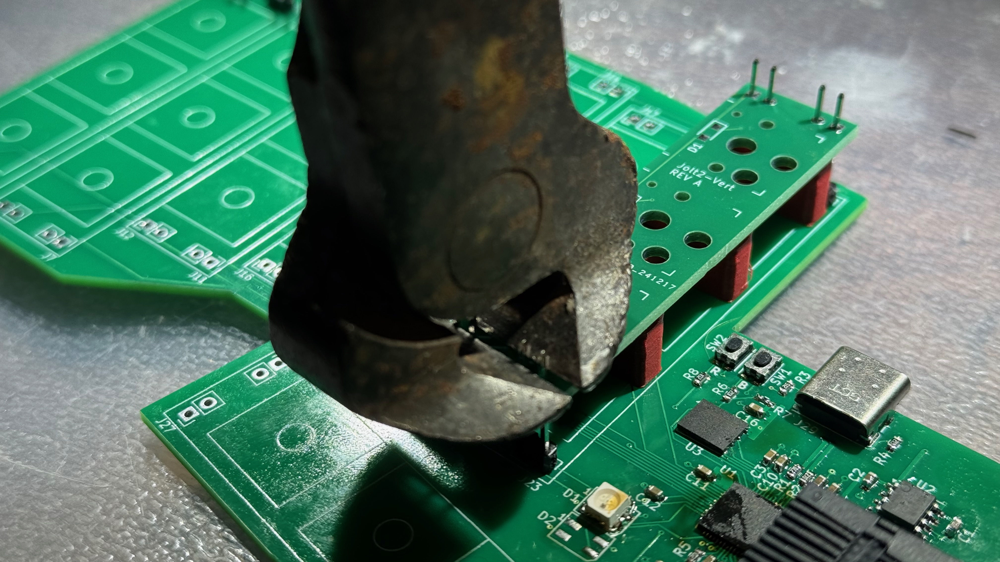

After possibly cutting the pins, place the appropriate riser board (see below) and solder it down.
Again, make sure that it sits flush against the spacer for each pin you solder.

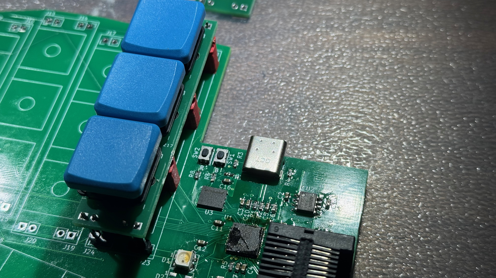
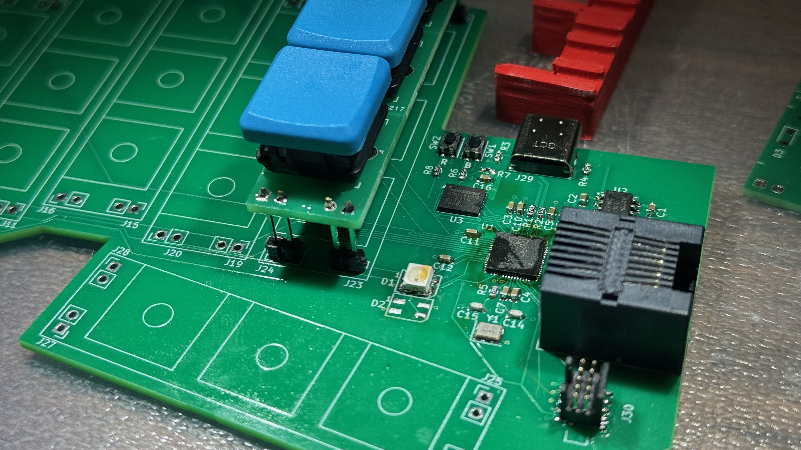

When you are finished with all of the finger risers, it should look something like this:

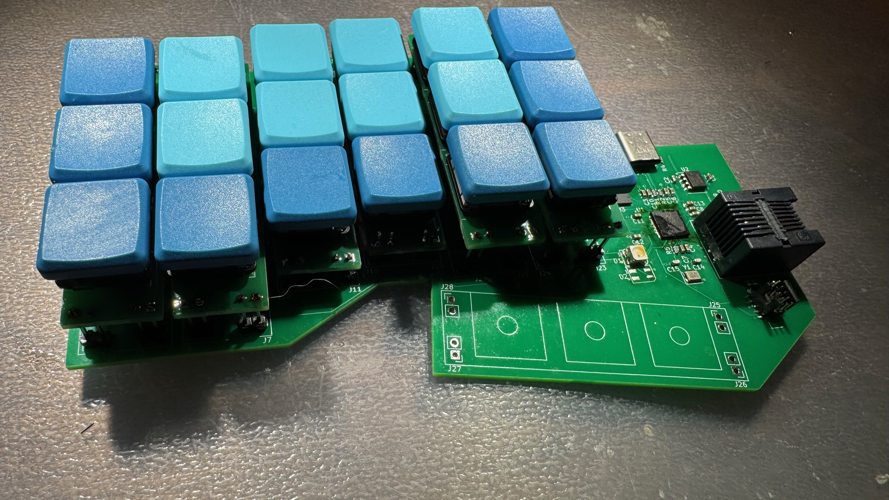
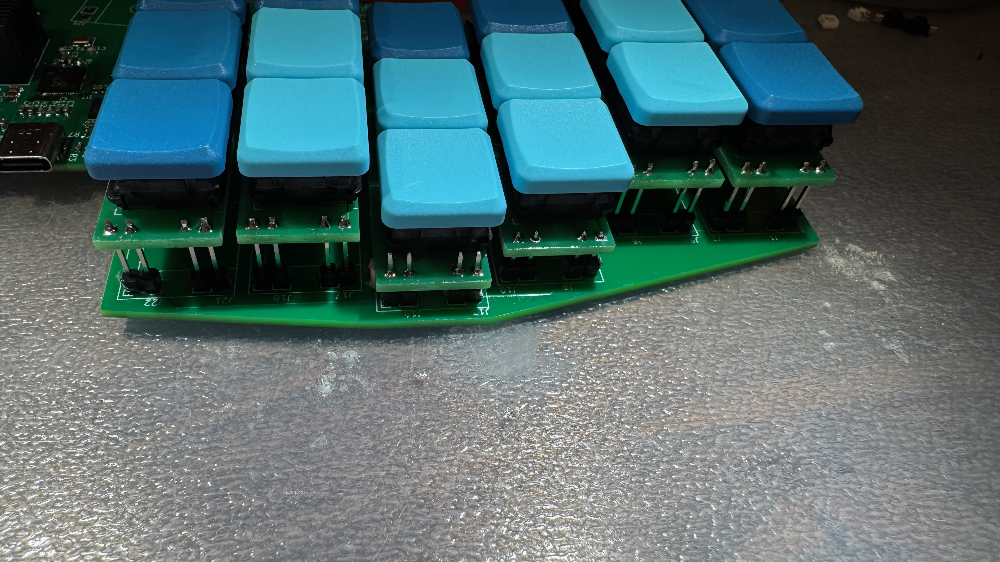

Lastly, install the thumb keys.  I install them only using the header plastic part for spacing.  The
end result looks like this:

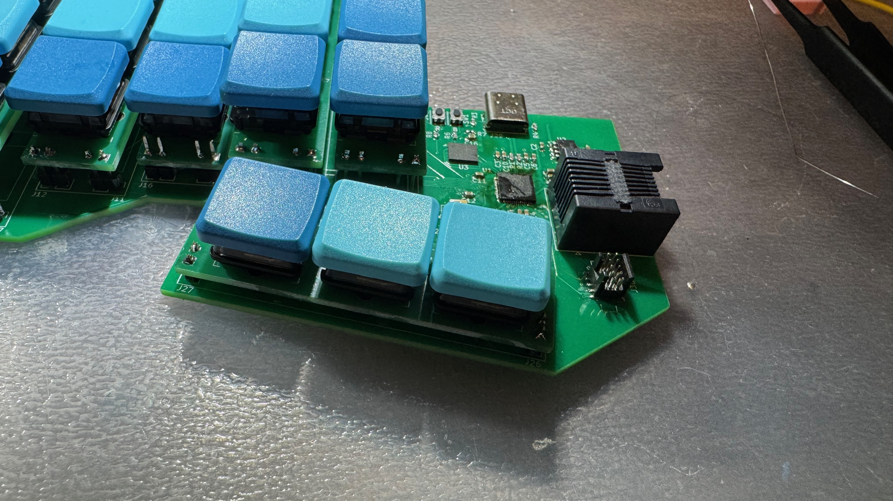

## Assembling the case

As of 2025-01-04, I am still working on the case design.  Instructions to follow here.
